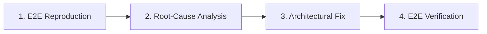
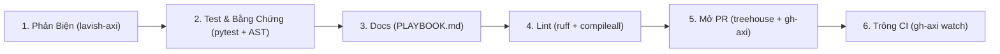

# AGENTS.md — Constitution & Operational Framework

Tài liệu này là hiến pháp vận hành và quy chuẩn kỹ thuật bắt buộc cho toàn bộ Agent khi làm việc trong dự án.

---

## I. Tôn Chỉ Kỹ Thuật (Engineering Philosophy)

1. **High-Leverage Execution (Không Ngại Khó — Không Chọn Cách Rẻ Tiền):**
   - Tuyệt đối không chọn giải pháp chắp vá (monkey-patch), giải pháp tạm bợ hoặc mã nguồn khó bảo trì.
   - Luôn ưu tiên kiến trúc chuẩn công nghiệp (production-grade): modular hóa cao, type-hinting chặt chẽ, logging minh bạch, cấu trúc dữ liệu rõ ràng.
   - Nhận thức về năng lực thực thi: Việc ước tính thủ công có thể tốn vài tuần nhưng khi AI phối hợp thực hiện chỉ mất vài phút. Hãy chủ động xây dựng test suite, tooling tự động và phân tích hệ thống toàn diện ngay từ đầu.

2. **Bảo Toàn Ngữ Cảnh Tinh Gọn (Context Efficiency):**
   - Không đưa toàn bộ chi tiết cồng kềnh vào context mặc định.
   - Áp dụng triệt để nguyên lý **Progressive Disclosure**: Chỉ lưu mô tả ngắn (metadata) ở mức tổng quan; chỉ tải toàn bộ nội dung chi tiết khi thực sự cần giải quyết tác vụ liên quan.

---

## II. Giao Thức Sửa Lỗi Tối Thượng (E2E Bug Reproduction Protocol)

Mọi quy trình sửa lỗi trong dự án bắt buộc phải tuân thủ nghiêm ngặt 4 bước theo đúng thứ tự:



1. **Bước 1: Tái hiện E2E (E2E Reproduction First):**
   - **CẤM sửa code trước khi tái hiện được lỗi.**
   - Tạo ngay một script độc lập hoặc lệnh thực thi mô phỏng chính xác 100% bối cảnh, tham số đầu vào và luồng chạy thực tế mà người dùng/hệ thống đã gặp phải.
   - Chỉ viết unit test là **chưa đủ**. Phải có bài test chạy End-to-End chứng minh lỗi xuất hiện trong môi trường thực tế.

2. **Bước 2: Phân tích Nguyên nhân Cốt lõi (Root-Cause Analysis):**
   - Phân tích cơ chế kỹ thuật sâu gây ra lỗi, tìm hiểu các giả định sai lầm ban đầu.
   - Không được "chữa triệu chứng" (ví dụ: bọc try-except vô tội vạ để giấu lỗi).

3. **Bước 3: Sửa lỗi Chuẩn kiến trúc (Architectural Fix):**
   - Tái cấu trúc và sửa lỗi từ tận gốc rễ. Đảm bảo tính mở rộng và không làm ảnh hưởng đến các thành phần liên quan.

4. **Bước 4: Kiểm chứng E2E & Hồi quy (Verification & Regression):**
   - Chạy lại bài test E2E ở Bước 1. Lỗi phải biến mất hoàn toàn.
   - Chạy lại các pipeline/test liên quan để đảm bảo không phát sinh lỗi mới.
   - **Ghi lại bài học kinh nghiệm vào [PLAYBOOK.md](file:///data/đề tài xuất sắc/PLAYBOOK.md)** ngay sau khi hoàn tất.

---

## III. Pipeline Phát Triển: No-Mistake (Băng Chuyền 6 Bước Tích Hợp)

Mọi mã nguồn mới hoặc thay đổi chức năng đều phải đi qua băng chuyền chuẩn hóa gồm 6 trạm nghiêm ngặt trước khi được tích hợp. Toàn bộ công cụ đã cài đặt (`treehouse`, `gh-axi`, `lavish-axi`, `ruff`, `pytest`) đã được ráp thành CLI điều phối thống nhất: `./pipeline` (hoặc `scripts/conveyor.py`).



### Các Lệnh Điều Phối Băng Chuyền (Conveyor CLI)
- `./pipeline status`: Kiểm tra toàn diện tính sẵn sàng của 7 công cụ (`treehouse`, `gh-axi`, `lavish-axi`, `ruff`, `pytest`, `git`, `python3`) và dữ liệu.
- `./pipeline run`: Tự động vận hành liên hoàn 6 trạm từ Trạm 1 đến Trạm 6.
- `./pipeline station <1..6>`: Vận hành độc lập từng trạm cụ thể.
- `./pipeline medical [--step 1..8] [--dry-run]`: Điều phối pipeline 8 bước xử lý ảnh bệnh học mô học.

### Quy Trình Chi Tiết Từng Trạm:
1. **Trạm 1: Review Phản Biện (Adversarial Critique & Lavish Dashboard):**
   - Tự động chạy bộ kiểm tra tĩnh & ranh giới y tế (Zero Patient Leakage, VRAM bounds, tính tương thích Local/Colab).
   - Tích hợp `lavish-axi`: Tự động sinh báo cáo tương tác trực quan tại `.lavish/pipeline_review.html`.
   - Có thể mở phiên review trực quan bằng cờ `--launch-lavish`.

2. **Trạm 2: Test + Bằng Chứng (Testing with Verifiable Proof & AST Integrity):**
   - Chạy test suite thực tế qua `pytest tests`.
   - **AST Integrity Check:** Phân tích cú pháp AST đảm bảo 100% test method có active assertion (`assert` hoặc context `pytest.raises`), tuyệt đối cấm test rỗng/test giả tạo.
   - **Bằng chứng thực thi:** Tự động lưu log chi tiết (timestamp, commit hash, duration, output) vào `Results/proofs/test_evidence_<timestamp>.log`.

3. **Trạm 3: Docs (Documentation Sync):**
   - Đồng bộ docstrings và type annotations.
   - Tự động kiểm tra tính hợp lệ của [PLAYBOOK.md](file:///data/đề tài xuất sắc/PLAYBOOK.md) theo chuẩn Điều IV.

4. **Trạm 4: Lint (Static Analysis & Clean Code):**
   - Chạy `ruff check .` và `python3 -m compileall -q .`.
   - Đảm bảo 0 warning / 0 error.

5. **Trạm 5: Mở PR (Pull Request Preparation & Delivery via Treehouse & gh-axi):**
   - Tích hợp `treehouse`: Quản lý nhánh độc lập trong worktree cách ly (`.worktrees/`), khóa worktree (`treehouse lock`).
   - Tích hợp `gh-axi`: Kiểm tra commit theo Conventional Commits, tự động soạn thảo PR body chuẩn cấu trúc (Why, What, Test Evidence), và gọi `gh-axi pr create`.

6. **Trạm 6: Trông CI (CI Watch to Green via gh-axi):**
   - Tích hợp `gh-axi`: Theo dõi tiến độ GitHub Actions qua `gh-axi run list` và `gh-axi run watch` cho đến khi tất cả checks chuyển sang Green.

---

## IV. Sổ Tay Lỗi & Học Tập Liên Tục (Playbook Policy)

1. **Quy định ghi chép bài học:**
   - Mỗi lần phát sinh lỗi và sửa xong hoàn toàn, Agent phải cập nhật một mục mới vào [PLAYBOOK.md](file:///data/đề tài xuất sắc/PLAYBOOK.md).
   - Mục đích: Tránh tái diễn sai lầm cũ, giúp Agent các phiên sau làm việc chính xác và thành thạo hơn.
2. **Cấu trúc bắt buộc của mỗi entry:**
   - Mã định danh lỗi (`[ERR-YYYYMMDD-XX]`) và tên bản chất lỗi.
   - Triệu chứng (Symptom).
   - Đường dẫn tái hiện E2E (Reproduction Path).
   - Nguyên nhân cốt lõi (Root Cause).
   - Giả định sai lầm (Wrong Assumptions).
   - Giải pháp triệt để & Kết quả kiểm chứng (Resolution & Proof).
   - Quy tắc phòng ngừa vàng (Golden Prevention Rule).

---

## V. Cơ Chế Phân Tầng Tri Thức (Progressive Disclosure & Skill Extraction)

Để tránh làm dày context và làm loãng năng lực suy luận của Agent:

1. **Ngưỡng tách Skill:**
   - Khi [PLAYBOOK.md](file:///data/đề tài xuất sắc/PLAYBOOK.md) vượt quá ~200 dòng, hoặc xuất hiện cụm 3 bài học trở lên về cùng một chủ đề chuyên sâu (ví dụ: *Patient-Level Data Split*, *Colab GPU Memory Management*, *Tissue Detection Pipeline*).
2. **Quy trình module hóa thành Skill:**
   - Chuyển toàn bộ kiến thức chuyên sâu của chủ đề đó vào thư mục `.agents/skills/<skill-name>/SKILL.md`.
   - Mỗi skill bắt buộc phải có YAML frontmatter chuẩn:
     ```markdown
     ---
     name: <tên_skill>
     description: <Mô tả ngắn gọn 1-2 câu: Làm gì? Khi nào kích hoạt?>
     ---
     ```
   - Trong [PLAYBOOK.md](file:///data/đề tài xuất sắc/PLAYBOOK.md), chỉ giữ lại 1 dòng tóm tắt và đường dẫn trỏ tới skill.
   - **Nguyên tắc đọc:** Agent thông thường chỉ đọc `description` ngắn; chỉ khi gặp bài toán liên quan mới dùng `view_file` mở toàn bộ `SKILL.md`.

---

## VI. Ranh Giới Đỏ Nghiệp Vụ (Medical AI Domain Guardrails)

Dự án xử lý ảnh bệnh học mô học (ISUP grading, Kruss, 40X, cấu trúc bệnh nhân). Bắt buộc tuân thủ:

1. **Zero Patient Data Leakage:**
   - Tuyệt đối phân chia train/val/test theo cấp độ bệnh nhân (`patient_id` hoặc tiền tố định danh bệnh nhân). Ảnh của cùng một bệnh nhân **không bao giờ** được xuất hiện đồng thời ở cả tập train và val/test.
2. **Toàn Vẹn Dữ Liệu (Data Integrity & QC):**
   - Luôn kiểm tra tính hợp lệ của metadata, độ phóng đại vật kính (objective lens), và tỷ lệ mô trước khi đưa vào pipeline huấn luyện.
3. **Môi Trường Huấn Luyện (Colab / GPU Isolation):**
   - Mã nguồn training phải tương thích linh hoạt giữa môi trường chạy nội bộ và Google Colab (đường dẫn dữ liệu, RAM/VRAM checkpoint, OOM recovery).
