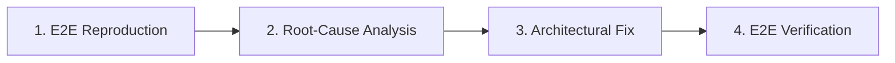
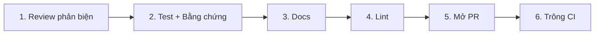

# AGENTS.md — Constitution & Operational Framework

Tài liệu này là hiến pháp vận hành và quy chuẩn kỹ thuật bắt buộc cho toàn bộ Agent khi làm việc trong dự án.

---

## I. Tôn Chỉ Kỹ Thuật (Engineering Philosophy)

1. **High-Leverage Execution (Không Ngại Khó — Không Chọn Cách Rẻ Tiền):**
   - Tuyệt đối không chọn giải pháp chắp vá (monkey-patch), giải pháp tạm bợ hoặc mã nguồn khó bảo trì.
   - Luôn ưu tiên kiến trúc chuẩn công nghiệp (production-grade): modular hóa cao, type-hinting chặt chẽ, logging minh bạch, cấu trúc dữ liệu rõ ràng.
   - Nhận thức về năng lực thực thi: Việc ước tính thủ công có thể tốn vài tuần nhưng khi AI phối hợp thực hiện chỉ mất vài phút. Hãy chủ động xây dựng test suite, tooling tự động và phân tích hệ thống toàn diện ngay từ đầu.

2. **Bảo Toàn Ngữ Cảnh Tinh Gọn (Context Efficiency):**
   - Không đưa toàn bộ chi tiết cồng kềnh vào context mặc định.
   - Áp dụng triệt để nguyên lý **Progressive Disclosure**: Chỉ lưu mô tả ngắn (metadata) ở mức tổng quan; chỉ tải toàn bộ nội dung chi tiết khi thực sự cần giải quyết tác vụ liên quan.

---

## II. Giao Thức Sửa Lỗi Tối Thượng (E2E Bug Reproduction Protocol)

Mọi quy trình sửa lỗi trong dự án bắt buộc phải tuân thủ nghiêm ngặt 4 bước theo đúng thứ tự:



1. **Bước 1: Tái hiện E2E (E2E Reproduction First):**
   - **CẤM sửa code trước khi tái hiện được lỗi.**
   - Tạo ngay một script độc lập hoặc lệnh thực thi mô phỏng chính xác 100% bối cảnh, tham số đầu vào và luồng chạy thực tế mà người dùng/hệ thống đã gặp phải.
   - Chỉ viết unit test là **chưa đủ**. Phải có bài test chạy End-to-End chứng minh lỗi xuất hiện trong môi trường thực tế.

2. **Bước 2: Phân tích Nguyên nhân Cốt lõi (Root-Cause Analysis):**
   - Phân tích cơ chế kỹ thuật sâu gây ra lỗi, tìm hiểu các giả định sai lầm ban đầu.
   - Không được "chữa triệu chứng" (ví dụ: bọc try-except vô tội vạ để giấu lỗi).

3. **Bước 3: Sửa lỗi Chuẩn kiến trúc (Architectural Fix):**
   - Tái cấu trúc và sửa lỗi từ tận gốc rễ. Đảm bảo tính mở rộng và không làm ảnh hưởng đến các thành phần liên quan.

4. **Bước 4: Kiểm chứng E2E & Hồi quy (Verification & Regression):**
   - Chạy lại bài test E2E ở Bước 1. Lỗi phải biến mất hoàn toàn.
   - Chạy lại các pipeline/test liên quan để đảm bảo không phát sinh lỗi mới.
   - **Ghi lại bài học kinh nghiệm vào [PLAYBOOK.md](file:///data/đề tài xuất sắc/PLAYBOOK.md)** ngay sau khi hoàn tất.

---

## III. Pipeline Phát Triển: No-Mistake (Băng Chuyền 6 Bước)

Mọi mã nguồn mới hoặc thay đổi chức năng đều phải đi qua băng chuyền chuẩn hóa gồm 6 trạm nghiêm ngặt trước khi được tích hợp. Tuyệt đối không nhảy cóc hoặc cắt xén quy trình.



1. **Trạm 1: Review Phản Biện (Adversarial Critique):**
   - Tự phản biện và lật lại vấn đề trước khi viết hoặc chốt code:
     - Thiết kế có kẽ hở logic, memory/VRAM leak hoặc race condition nào không?
     - Có nguy cơ vi phạm ranh giới dữ liệu y tế (patient data leakage) không?
     - Có giả định ngầm nào về đường dẫn, cấu trúc dữ liệu hoặc môi trường (Local vs Colab) chưa được kiểm soát?
   - Chỉ chuyển trạm khi toàn bộ nghi vấn phản biện đã có lời giải thỏa đáng.

2. **Trạm 2: Test + Bằng Chứng (Testing with Verifiable Proof):**
   - Viết và chạy test thực tế bao phủ đầy đủ các ca thành công và ca biên (edge cases).
   - **Bắt buộc có bằng chứng thực thi:** Phải có log chạy thực tế, output stdout/stderr, test summary hoặc metrics minh bạch chứng minh test pass 100%. Tuyệt đối không suy đoán hay nói suông "code chạy được".

3. **Trạm 3: Docs (Documentation Sync):**
   - Đồng bộ tài liệu kỹ thuật ngay khi code thay đổi:
     - Docstrings chuẩn mực, type annotations rõ ràng và chính xác.
     - Cập nhật hướng dẫn sử dụng, giải thích tham số nếu thay đổi interface/pipeline.
     - Đồng bộ bài học kinh nghiệm vào [PLAYBOOK.md](file:///data/đề tài xuất sắc/PLAYBOOK.md) nếu có phát hiện quan trọng.

4. **Trạm 4: Lint (Static Analysis & Clean Code):**
   - Kiểm tra tĩnh toàn bộ mã nguồn bằng linter và formatter (flake8/ruff, black, mypy,...).
   - Đảm bảo 0 warning/error: không có dead code, import thừa, biến không dùng hoặc format lệch chuẩn.

5. **Trạm 5: Mở PR (Pull Request Preparation & Delivery):**
   - Đóng gói commit gọn gàng theo chuẩn Conventional Commits (`feat:`, `fix:`, `refactor:`, `test:`, `docs:`).
   - Tạo PR/bản giao nộp với mô tả cấu trúc đầy đủ: Bối cảnh (Why), Chi tiết thay đổi (What), Bằng chứng nghiệm thu (Test Evidence).

6. **Trạm 6: Trông CI (CI Watch to Green):**
   - Giám sát tiến độ chạy CI/CD pipeline cho đến khi toàn bộ checks chuyển sang trạng thái thành công (Green).
   - Nếu CI fail: Không bỏ mặc hoặc chuyển giao task; chủ động đào sâu log lỗi, khắc phục tận gốc và verify lại cho đến khi CI xanh hoàn toàn.

---

## IV. Sổ Tay Lỗi & Học Tập Liên Tục (Playbook Policy)

1. **Quy định ghi chép bài học:**
   - Mỗi lần phát sinh lỗi và sửa xong hoàn toàn, Agent phải cập nhật một mục mới vào [PLAYBOOK.md](file:///data/đề tài xuất sắc/PLAYBOOK.md).
   - Mục đích: Tránh tái diễn sai lầm cũ, giúp Agent các phiên sau làm việc chính xác và thành thạo hơn.
2. **Cấu trúc bắt buộc của mỗi entry:**
   - Mã định danh lỗi (`[ERR-YYYYMMDD-XX]`) và tên bản chất lỗi.
   - Triệu chứng (Symptom).
   - Đường dẫn tái hiện E2E (Reproduction Path).
   - Nguyên nhân cốt lõi (Root Cause).
   - Giả định sai lầm (Wrong Assumptions).
   - Giải pháp triệt để & Kết quả kiểm chứng (Resolution & Proof).
   - Quy tắc phòng ngừa vàng (Golden Prevention Rule).

---

## V. Cơ Chế Phân Tầng Tri Thức (Progressive Disclosure & Skill Extraction)

Để tránh làm dày context và làm loãng năng lực suy luận của Agent:

1. **Ngưỡng tách Skill:**
   - Khi [PLAYBOOK.md](file:///data/đề tài xuất sắc/PLAYBOOK.md) vượt quá ~200 dòng, hoặc xuất hiện cụm 3 bài học trở lên về cùng một chủ đề chuyên sâu (ví dụ: *Patient-Level Data Split*, *Colab GPU Memory Management*, *Tissue Detection Pipeline*).
2. **Quy trình module hóa thành Skill:**
   - Chuyển toàn bộ kiến thức chuyên sâu của chủ đề đó vào thư mục `.agents/skills/<skill-name>/SKILL.md`.
   - Mỗi skill bắt buộc phải có YAML frontmatter chuẩn:
     ```markdown
     ---
     name: <tên_skill>
     description: <Mô tả ngắn gọn 1-2 câu: Làm gì? Khi nào kích hoạt?>
     ---
     ```
   - Trong [PLAYBOOK.md](file:///data/đề tài xuất sắc/PLAYBOOK.md), chỉ giữ lại 1 dòng tóm tắt và đường dẫn trỏ tới skill.
   - **Nguyên tắc đọc:** Agent thông thường chỉ đọc `description` ngắn; chỉ khi gặp bài toán liên quan mới dùng `view_file` mở toàn bộ `SKILL.md`.

---

## VI. Ranh Giới Đỏ Nghiệp Vụ (Medical AI Domain Guardrails)

Dự án xử lý ảnh bệnh học mô học (ISUP grading, Kruss, 40X, cấu trúc bệnh nhân). Bắt buộc tuân thủ:

1. **Zero Patient Data Leakage:**
   - Tuyệt đối phân chia train/val/test theo cấp độ bệnh nhân (`patient_id` hoặc tiền tố định danh bệnh nhân). Ảnh của cùng một bệnh nhân **không bao giờ** được xuất hiện đồng thời ở cả tập train và val/test.
2. **Toàn Vẹn Dữ Liệu (Data Integrity & QC):**
   - Luôn kiểm tra tính hợp lệ của metadata, độ phóng đại vật kính (objective lens), và tỷ lệ mô trước khi đưa vào pipeline huấn luyện.
3. **Môi Trường Huấn Luyện (Colab / GPU Isolation):**
   - Mã nguồn training phải tương thích linh hoạt giữa môi trường chạy nội bộ và Google Colab (đường dẫn dữ liệu, RAM/VRAM checkpoint, OOM recovery).
