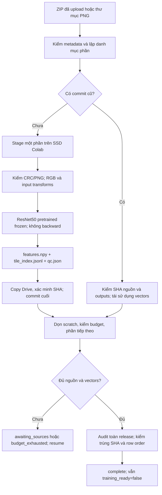

# Hướng dẫn vận hành feature extractor

Notebook `notebooks/Colab_Feature_Extraction.ipynb` chạy encoder ResNet50 đã cố định trên PNG đã cắt sẵn. Nó không cắt lại ảnh, sửa màu, gán nhãn patch, tạo bag/MIL hay huấn luyện mô hình. Feature vector là biểu diễn ảnh; không phải kết luận ung thư hoặc nhãn bệnh. Encoder trả 2.048 số/patch, lưu float32. Đầu vào model dùng phép biến đổi cố định của weights V1: RGB, resize cạnh ngắn 256, center-crop 224, chia giá trị pixel về 0–1 rồi chuẩn hóa theo mean/std ImageNet. Đây là biến đổi tensor đầu vào; PNG nguồn vẫn nguyên vẹn. Không chuẩn hóa màu nhuộm (stain normalization), không fit tham số từ toàn cohort.

Metadata.xlsx vẫn là nguồn metadata. Label chỉ là ứng viên ở cấp ca và cần được review; danh tính bệnh nhân chưa được xác minh. Vì vậy `training_ready` luôn là `false` ở bước này.

## Dữ liệu và đường dẫn

Tải bundle mới `histology-feature-runtime.zip` vào `histology/runtime/`. Bundle cũ `histology-data-runtime.zip` chỉ dành cho pipeline precut và không có feature extractor. Giữ `Metadata.xlsx` tại `histology/source/Metadata.xlsx`. Mặc định ZIP nằm trong `histology/source/archives/`; PNG ở thư mục là một chế độ nguồn khác, mặc định `histology/source/tiles/`.

| Nội dung | Mặc định trên Drive | Ghi chú |
| --- | --- | --- |
| Runtime | `histology/runtime/histology-feature-runtime.zip` | Dùng bundle feature mới. |
| Metadata | `histology/source/Metadata.xlsx` | Bắt buộc. |
| ZIP nguồn | `histology/source/archives/Tiles-*.zip` | Có thể chạy khi mới tải một phần trong 25 ZIP. Không nén lại ZIP. |
| Thư mục PNG | `histology/source/tiles/` | Chọn thay cho ZIP; mỗi lượt chỉ dùng một loại nguồn. |
| ResNet50 weights | `histology/encoders/resnet50_imagenet_v1/` | Extractor tự tải cache chính thức nếu thiếu và có Internet; cache nằm trong thư mục con `resnet50_imagenet1k_v1/`. |
| Smoke output | `histology/features/smoke_v001/` | Lựa chọn một part/sáu patch được khóa ở lần smoke đầu; rerun không tăng số mẫu. |
| Production output | `histology/features/v001/` | Không giới hạn số patch; được dùng lại khi resume. |
| Work files | `/content/histology-feature-work/` | Tạm trên SSD phiên Colab, không phải thư mục lưu kết quả. |

ZIP có thể được tải lên dần. Notebook chỉ báo số archive hiện có, không chặn vì chưa đủ 25. `expected_archives=25` và `expected_pngs=148991` dùng để đánh giá độ hoàn chỉnh; trạng thái chỉ thành `complete` khi nguồn đã đạt kỳ vọng đã cấu hình. Khi dùng directory mode, cung cấp toàn bộ thư mục dự kiến và xác nhận số PNG qua status/QC. Nguồn gốc được giữ nguyên tại chỗ; chỉ part đang xử lý được stage trên SSD phiên, không tạo thêm bản ZIP/PNG gốc ở Drive.

## Môi trường Colab hoặc máy cục bộ

Trong Colab, trước khi chạy, tự chọn GPU T4 trong menu runtime nếu muốn dùng CUDA. Notebook chỉ kiểm tra thiết bị của phiên hiện tại; nó không tạo, đổi loại hoặc dừng VM. Giữ PyTorch và torchvision đã có trong môi trường nếu cặp đó tương thích. Notebook không cài lại package GPU và không tải code từ mạng.

Nếu cache ResNet50 ImageNet V1 chưa có, lượt đầu có Internet tự tải checkpoint chính thức (khoảng 100 MB), xác minh SHA-256 `0676ba61b6795bbe1773cffd859882e5e297624d384b6993f7c9e683e722fb8a`, rồi cache vào `WEIGHTS_DIR/resnet50_imagenet1k_v1/`. Không cần chuẩn bị sẵn weights khi có Internet. Khi chạy offline, chuẩn bị checkpoint và `manifest.json` đã xác minh trước trong thư mục cache đó.

Để chạy cục bộ, giải nén bundle runtime trong môi trường dự án rồi cài dependencies khai báo trong `requirements-features.txt` vào virtual environment. Dùng cặp PyTorch/torchvision phù hợp với máy; trong notebook đặt `DEVICE = 'cpu'` để dùng CPU. Với môi trường không có Internet, có thể cài từ wheelhouse cục bộ bằng `python -m pip install --no-index --find-links /path/to/wheelhouse -r requirements-features.txt`; wheelhouse phải có dependency và cặp Torch phù hợp. Mở notebook trong Jupyter và sửa `ROOT` thành thư mục dữ liệu cục bộ. Runtime bundle chứa code; dữ liệu nguồn và weights không nằm trong bundle.

Notebook giải nén runtime vào thư mục tạm riêng của phiên và thêm thư mục đó vào `sys.path`. Nó không sửa bản runtime đã lưu trên Drive. Nếu thiếu dependency, cài trong môi trường trước khi chạy lại notebook; không dùng cài đặt mù có thể thay đổi Torch/CUDA hiện hữu.

## Quy trình chạy

1. Mở notebook, mount đúng tài khoản Drive có quyền đọc nguồn và ghi output. Kiểm tra `ROOT`, metadata, runtime bundle mới và thư mục nguồn.
2. Chọn `SOURCE_KIND = 'zip'` hoặc `SOURCE_KIND = 'directory'`. Đặt `RUN_MODE = 'smoke'` cho lần đầu. Mỗi lượt smoke ghi vào `features/smoke_v001/`, xử lý tối đa một part mới với sáu patch, và mẫu được chọn xen kẽ vật kính để kiểm tra đường đi. Danh sách part được lưu trong `smoke_selection.json`, nên rerun cùng nguồn tiếp tục xác minh đúng cùng part và không mở rộng smoke khi ZIP mới được tải thêm. Muốn tạo sample khác, đổi sang namespace smoke mới. Cell cấu hình cho phép chỉnh `BATCH_SIZE`, `DEVICE`, `PRECISION`, `BUDGET_MINUTES`, `RESERVE_MINUTES`, `RECOVER_STALE_LOCK` và `PRODUCTION_MAX_NEW_PARTS`. Xem QC, index, checksum/commit và các output trước khi quyết định chạy production.
3. Khi smoke đã được review, đặt `RUN_MODE = 'production'`. Production dùng `features/v001/`, xử lý tuần tự và ghi riêng từng part đã xác minh. Không chạy hai phiên đồng thời vào cùng thư mục output.
4. Nếu đang tải ZIP dần, có thể chạy production trước khi đủ 25 file. Sau khi upload thêm, chạy lại với cùng nguồn, mode và output. Rerun sẽ kiểm tra commit hiện có rồi tiếp tục phần chưa hoàn thành. Việc kiểm tra toàn vẹn hash có thể đọc lại bytes của ZIP hoặc PNG đã commit, nhưng không stage lại part đó và không chạy encoder/GPU lần nữa. Không đổi nguồn ZIP sang directory giữa một lượt resume; mỗi lần chạy chỉ chọn một source mode. Loại nguồn và cách chia part tham gia `feature_id`, nên ZIP và directory được lưu thành các phiên bản riêng.

Notebook gọi API Python `histology_data.features.run_feature_extraction`. Các lệnh sau hữu ích khi vận hành runtime cục bộ:

```bash
python -m histology_data.feature_cli status --output /path/to/features/v001
python -m histology_data.feature_cli verify --output /path/to/features/v001
```

Lệnh `run --config PATH` cũng được hỗ trợ nếu cần chạy ngoài notebook. `configs/features_colab.json` là JSON đầy đủ, hợp lệ cho CLI với đường dẫn Colab mặc định; sửa các path nếu chạy trực tiếp trên máy khác. Notebook dùng cùng config đó làm mặc định, sau đó gắn đường dẫn theo `ROOT` và áp profile smoke/production trong cell.

## Ngân sách và khóa phiên

Mặc định là ngân sách 240 phút với 30 phút dự trữ để flush/commit và ghi báo cáo. Trong notebook chỉnh `BUDGET_MINUTES` và `RESERVE_MINUTES` theo thời gian còn được phép của phiên, tính cả khởi động, mount Drive và thao tác thủ công; cấu hình CLI dùng `budget_minutes` và `reserve_minutes`. Đây là giới hạn của lần chạy, không phải bảo đảm về runtime hoặc quota của Google. Môi trường hiện có ngân sách vận hành cục bộ 330 phút/ngày và đã dùng 67 phút hôm nay; hãy tự đặt giới hạn theo phần còn lại được phép.

Notebook không tự tạo/xóa VM, luân phiên tài khoản hoặc gọi email/Slack. Khi trạng thái đã hoàn tất, chờ upload hoặc lỗi, người vận hành phải tự ngắt/xóa runtime Colab để dừng GPU idle.

Mặc định `recover_lock=false`. Chỉ bật `RECOVER_STALE_LOCK=True` sau khi đã xác nhận phiên trước dừng hẳn và không còn tiến trình ghi cùng output. Không dùng tùy chọn này để chạy song song hoặc chiếm lock của runtime đang chạy.

## Output, status và resume

Mỗi part hoàn tất mới được commit; part đang xử lý dở không được xem là dữ liệu đã hoàn tất. `status.json` nằm ngay trong thư mục output đã chọn và có `feature_id`, `completed_parts`, `observed_pngs`, `committed_vectors`, `expected_sources`, `expected_pngs`, `source_complete` và `training_ready`. Release hiện tại nằm tại `output/<feature_id>/release.json`; snapshot của từng lượt nằm tại `output/runs/<run_id>/release_snapshot.json`. Nếu đã có release đầy đủ rồi một lượt sau chỉ tạo được release một phần, bản đầy đủ được giữ nguyên và bản mới ghi vào `partial_release.json`. Trong mỗi part kiểm tra `features.npy`, `tile_index.jsonl`, `qc.json` và `commit.json` cùng checksum trước khi dùng feature cho công việc tiếp theo. Không sửa thủ công file trong part đã commit.

| Status | Ý nghĩa và hành động |
| --- | --- |
| `smoke_complete` | Smoke chạy xong. Review kỹ output rồi mới chuyển sang production. |
| `auditing` | Đang kiểm toàn bộ vectors/index và trùng nội dung; chưa được báo hoàn tất. |
| `complete` | Đủ nguồn và vectors; toàn bộ parts đã qua audit. Đây vẫn chưa phải bộ train-ready. |
| `awaiting_sources` | Có thể tiếp tục nhưng còn nguồn dự kiến chưa có. Tải phần còn lại rồi resume cùng output. |
| `part_limit_reached` | Đã chạm giới hạn part của lượt này. Rerun cùng cấu hình để tiếp tục hoặc điều chỉnh giới hạn. |
| `budget_exhausted` | Lượt dừng theo ngân sách. Các commit hợp lệ được giữ; resume cùng output trong phiên được phép tiếp theo. |
| `interrupted` | Phiên dừng giữa part. Xác minh status/commit rồi resume. |
| `error` | Kiểm tra lỗi, QC và checksum trước khi rerun. Không bỏ qua lỗi để ép complete. |

## Khắc phục sự cố

| Tình huống | Cách xử lý |
| --- | --- |
| Chưa đủ ZIP vì đang upload | `awaiting_sources` là trạng thái có thể tiếp tục. Upload ZIP còn lại, không đổi tên/nội dung, rồi chạy lại cùng cấu hình và output. |
| Sai tài khoản Drive hoặc lỗi quyền | Kiểm tra tài khoản đang mount, `ROOT`, quyền đọc `Metadata.xlsx`/nguồn và quyền ghi thư mục output; mount lại đúng tài khoản rồi chạy lại. |
| Không có T4/CUDA | Chọn GPU trong giao diện Colab rồi chạy lại. Nếu chủ động chạy CPU cục bộ, đổi `device` thành `cpu`; không cài lại Torch/CUDA để vượt qua kiểm tra. |
| PNG lỗi, giá trị NaN hoặc checksum output không khớp | Dừng và xem báo cáo lỗi/QC. Giữ nguyên part và bằng chứng hiện tại, sửa nguồn hoặc môi trường tại gốc rồi chạy kiểm chứng lại; không xóa lỗi hay sửa commit bằng tay. |
| Hết VRAM | Extractor thử lại với batch nhỏ hơn theo chính sách retry. Nếu vẫn OOM, giảm `batch_size` (ví dụ 32 xuống 16 hoặc 8), rồi resume cùng output để giữ các part đã commit. |
| Colab bị ngắt giữa chừng | Mở phiên mới, gắn Drive và dùng lại cùng bundle code, config, source và output. Part đã commit được kiểm tra trước khi tái sử dụng; part chưa commit được chạy lại. |
| Thiếu hoặc sai weights | Có Internet thì lượt đầu tự tải cache ResNet50 V1 chính thức (~100 MB) và xác minh SHA trước khi dùng. Offline thì chuẩn bị checkpoint cùng manifest đã xác minh trong `WEIGHTS_DIR/resnet50_imagenet1k_v1/`. Không dùng weights khác tên/version để resume cùng namespace feature. |
| Lock còn lại từ phiên cũ | Xác nhận runtime cũ đã dừng. Chỉ sau đó bật `RECOVER_STALE_LOCK=True` cho lượt resume kế tiếp. Nếu chưa chắc, không chiếm lock. |

Khi output đã bị ghi thủ công hoặc commit/checksum không hợp lệ, tạo namespace output mới sau khi lưu lại bằng chứng cần thiết; không sửa file committed để làm cho status xanh.

## Kiểm thử đã thực hiện trước khi bàn giao

- Fixture E2E: ZIP/thư mục, upload một phần rồi thêm ZIP, giữ release đầy đủ khi nguồn tạm thiếu, resume không gọi encoder, smoke lặp vẫn giới hạn, source/PNG/output bị thay đổi, NaN, giả lập OOM, ngắt giữa part, ngân sách và khóa writer.
- Encoder thật: official ResNet50 V1, CPU, hai PNG cho mỗi vật kính 4×/10×/40×. Chỉ sáu patch thật (1,56 MB PNG) được đọc tại local, không quét pixel toàn dữ liệu. ZIP và directory tạo đủ sáu vector float32 2.048 chiều; resume không forward encoder.
- Notebook: chạy cả luồng code trên fixture sáu patch và runtime ZIP đã đóng gói.
- Chưa chạy GPU T4 hoặc full 148.991 patch bằng extractor mới. Lượt smoke trên Colab là kiểm tra môi trường GPU trước khi production; thời gian test CPU nhỏ không dùng để dự báo thời gian toàn dataset.

## Trường hợp thư mục Drive thiếu bản trùng tên hậu tố (1)

Bộ ZIP đã duyệt có `Tiles/IMG_20260325_133349_377/768_1280(1).png` trùng byte với `768_1280.png`. Lần kiểm Drive trước không thấy tên hậu tố (1). ZIP mode giữ hai instance đúng danh mục gốc, không cần chỉnh gì. Directory mode phải ghi rõ khác biệt này; không giảm số PNG kỳ vọng để ép complete. Adapter hỗ trợ `aliases` tường minh (virtual member, member thật và SHA đã xác minh), ghi `alias_reconstructed=true` và giữ bản trùng để review. Chỉ dùng mapping sau khi kiểm nguồn đúng bộ đã duyệt; không suy diễn bản thiếu khác.

```json
{
  "IMG_20260325_133349_377/768_1280(1).png": {
    "source_member": "IMG_20260325_133349_377/768_1280.png",
    "expected_sha256": "34522d76ff51f492b80f885d4d678d3473d9741cb2facd2d16374f7293f107fb"
  }
}
```

Giá trị trên truyền qua trường `aliases` trong config directory. Nếu tên virtual đã tồn tại thì không cấu hình alias. Với trường hợp khác, lưu báo cáo rồi nhờ kiểm tra nguồn; không tạo PNG giả.

## Sơ đồ một lượt chạy



`duplicate_groups/<sha>.jsonl` lưu nhóm PNG/RGB trùng cùng part, row_index, tile_id, member và mã ca ứng viên để truy ngược. Không tự loại bản trùng. Giữ snapshot Metadata đầu vào; nhãn ca đã review và patient_map cho training nên lưu riêng trong governance.

Tài liệu encoder/preprocessing chính thức: [Torchvision ResNet50](https://docs.pytorch.org/vision/stable/models/generated/torchvision.models.resnet50.html). Giảm lượt đọc nhỏ từ Drive: [Colab FAQ](https://research.google.com/colaboratory/faq.html).
