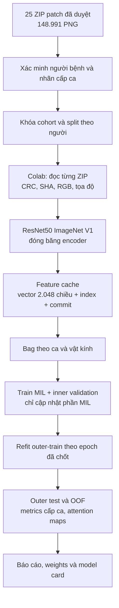
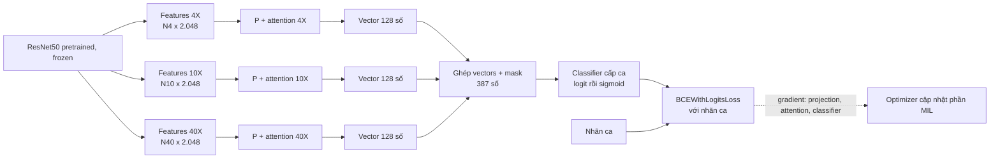
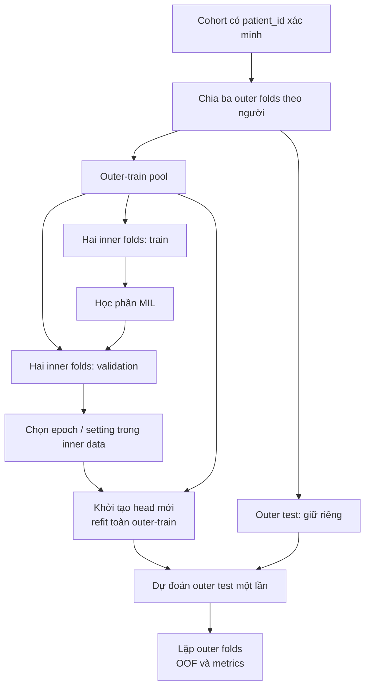

# Kế hoạch tham chiếu: phân loại mô học bằng MIL nhiều độ phóng đại

> **Vai trò tài liệu:** bản tham chiếu chính để phát triển và giám sát dự án. Số liệu và hiện trạng là snapshot ngày 10/10/2026. Các thông số mô hình/CV là thiết kế dự kiến, chưa phải kết quả thực thi. Khi thay đổi thiết kế hoặc chốt thông tin dữ liệu, cập nhật phiên bản và ghi lý do ở lịch sử thay đổi.

**Phiên bản kế hoạch 1.1 · 10/10/2026.** Đây là thiết kế dự kiến để giám sát và triển khai; chưa có kết quả train, thời gian benchmark T4 hoặc độ chính xác của mô hình mới.

**Quyết định vòng đầu:** dùng patch đã được duyệt → tải ResNet50 đã pretrain → đóng băng encoder và tạo feature cache một lần → train mô hình MIL cấp ca → so sánh 4×, 10×, 40× và fusion trên cùng cohort/fold. Mọi xử lý đầy đủ và tác vụ dài chạy trên Colab; local chỉ kiểm kê nhẹ và thử vài mẫu nhỏ khi phát triển.

## 1. Mục tiêu và những gì thực sự đã có

Mục tiêu đầu tiên là dự đoán **ca lành tính hay ca có ung thư** từ tập ảnh mô học của ca đó. Nhãn dự kiến lấy từ kết luận bệnh học đã được xác nhận. Không tự đổi `Glade` thành ISUP Grade Group và không gán nhãn ca dương thành nhãn ung thư cho mọi patch.

| Dữ liệu đã kiểm kê | 4× | 10× | 40× | Tổng |
|---|---:|---:|---:|---:|
| Ảnh nguồn có patch trong release | 223 | 420 | 1.169 | 1.812 |
| PNG patch | 10.017 | 25.726 | 113.248 | 148.991 |

- 25 ZIP độc lập, tổng 53,31 GB, đã sao chép về máy này; bản trên PC vẫn được giữ.
- Cả 1.812 tên ảnh nguồn khớp metadata. Không trùng **đường dẫn** patch giữa các ZIP; chưa kết luận không trùng **nội dung** ảnh.
- Có 18 mã ca ứng viên. Dựa trên kết luận hiện tại: 10 ca ứng viên lành, 8 ca ứng viên ung thư; nhãn vẫn cần xác nhận cho task mới.
- Cohort có đủ ba vật kính gồm 16 mã ca ứng viên: 9 lành, 7 ung thư. Một ca thiếu 4×, một ca chỉ có 40×.
- 18 mã ca chưa chứng minh là 18 người độc lập. `patient_id` phải được xác minh trước scientific training/evaluation.
- Hai PNG mẫu đã xem có preview 512×512. Script cũ mặc định crop 512, stride 256. Import phải ghi kích thước thực và đối chiếu log; không khẳng định toàn release cùng cấu hình chỉ từ hai mẫu.
- Bộ kiểm kê ZIP mới đối chiếu đủ 148.991 tên patch với metadata. Smoke giải mã 6 patch thật, hai mỗi vật kính. Một file 768_1280(1).png trùng byte và pixel với patch cùng tọa độ; cả hai được giữ và đánh dấu review. Đây chưa phải kiểm checksum/giải mã toàn release.
- Đã kiểm danh mục ZIP và việc chuyển file; chưa kiểm CRC, giải mã và checksum từng PNG toàn release. Việc này chạy trên Colab.
- Master metadata có 2.802 ảnh, release hiện có patch của 1.812 ảnh. 990 ảnh còn lại không được tự coi là dữ liệu train bị thiếu cần làm lại; ghi coverage và rà lý do chúng không có trong bộ đã duyệt.

Bằng chứng kiểm kê được lưu trong `Results/planning_20261010/`: `precut_archive_inventory.json`, `precut_source_images.csv`, `transfer_summary.json`. Bản HTML và các PNG/SVG minh họa cũng nằm tại đó. Source Drive: [Tiles đã duyệt](https://drive.google.com/drive/folders/1eOMrTFilpkHqbFfy_72qTYuiqLxMSg-Z).

**Giới hạn thực tế:** 148.991 patch là số đơn vị tính toán; số người độc lập mới quyết định sức mạnh của đánh giá. Bác sĩ duyệt chất lượng giúp kế thừa lựa chọn ảnh, nhưng không thay việc kiểm file khi nhập hoặc xác minh cấp nhãn/định danh.


### Sơ đồ tổng quát



## 2. Từ vựng để đọc sơ đồ

| Khái niệm | Trong dự án này |
|---|---|
| Người bệnh | Một người; có thể có nhiều hồ sơ/lần lấy mẫu |
| Ca | Một hồ sơ/lần lấy mẫu có kết luận riêng |
| Ảnh nguồn | Một trường nhìn kính hiển vi; tên `IMG_...` |
| Patch / instance | Vùng đã cắt; tên `x_y.png`; x/y theo ảnh nguồn |
| Encoder / backbone | Mạng đọc pixel và biến patch thành vector |
| Feature vector | 2.048 số với encoder baseline đã chọn; không phải nhãn ung thư |
| Bag cấp ca-vật kính | Tập vector của cùng ca ở một vật kính |
| Bag cấp ca | Các bag 4×/10×/40× của ca, cùng một nhãn kết luận |
| Shard / part | Đơn vị lưu/chuyển/resume; dùng ngay 25 ZIP hiện có |
| Fold | Một lần chia người để đánh giá; khác với ZIP và bag |
| Checkpoint | Trạng thái model và quá trình học để tiếp tục sau ngắt |
| Epoch | Một lượt đi qua các ca train; nhiều epoch lặp việc học |
| Fit | Một lần huấn luyện model cho một cấu hình và một lần chia tập |
| Loss | Con số đo mức sai giữa dự đoán và nhãn; dùng để học |
| Gradient / optimizer | Tín hiệu cho biết trọng số cần đổi thế nào / thuật toán thực hiện việc đổi |
| Learning rate | Mức lớn nhỏ của mỗi bước cập nhật trọng số |
| Softmax | Đổi điểm của các patch thành trọng số dương có tổng bằng 1 |
| Sigmoid | Đổi logit thành điểm trong khoảng 0–1; cần kiểm calibration trước khi hiểu như xác suất tin cậy |

Một vector không được mặc định là “vector ung thư”. Nó mô tả hình ảnh; phần MIL học cách dùng các vector để dự đoán ca.

## 3. Bài báo mẫu làm gì, mình kế thừa phần nào?

### MRMIL: bài sát về bệnh và nhiều độ phóng đại

[Li và cộng sự, 2021 — bài xuất bản](https://doi.org/10.1016/j.compbiomed.2021.104253), [bản tác giả](https://arxiv.org/html/2011.02679).

Nghiên cứu dùng 20.229 WSI của 830 người, nhãn từ báo cáo. Luồng: mask/crop/chuẩn hóa màu → MIL 5× tìm vùng → lấy **cùng vị trí** ở 10× để phân độ. Backbone VGG11bn tải ImageNet; đóng băng ba epoch rồi fine-tune ba block cuối. Train/valid/test được tách theo người.

**Áp dụng:** kế thừa nhãn yếu và pooling. Ảnh trường nhìn rời của mình chưa nối vị trí giữa vật kính, nên dùng fusion cấp ca. Vòng đầu phân loại nhị phân và encoder frozen; đây là thiết kế điều chỉnh, không tái lập MRMIL nguyên bản.

### Attention-MIL: nguyên lý của mô hình vòng đầu

[Ilse, Tomczak và Welling, ICML 2018](https://proceedings.mlr.press/v80/ilse18a.html).

Bài mô tả một nhãn cho cả bag và attention pooling không phụ thuộc thứ tự instance. Kế hoạch dùng nguyên lý này: mỗi vector có điểm attention, softmax thành trọng số, rồi tổng có trọng số tạo biểu diễn ca. Gated attention dùng thêm một nhánh sigmoid để điều tiết điểm.

**Áp dụng:** encoder ImageNet frozen, cache, ba nhánh vật kính và fusion là các lựa chọn bổ sung của dự án. Attention là đóng góp tương đối cho dự đoán bag; không tự trở thành nhãn hoặc xác suất ung thư của patch.

### CLAM: tham chiếu cách tổ chức features và MIL

[Lu và cộng sự, 2021 — toàn văn](https://pmc.ncbi.nlm.nih.gov/articles/PMC8711640/), [mã chính thức](https://github.com/mahmoodlab/CLAM).

CLAM dùng features từ encoder pretrained, attention cấp lam và ràng buộc phân cụm instance. Pipeline chính thức lưu features kèm tọa độ, tách dữ liệu theo người. Phần ResNet mặc định của pipeline CLAM tạo features 1.024 chiều; baseline mình chọn ResNet50 đầy đủ bỏ classifier, tạo 2.048 chiều.

**Áp dụng:** kế thừa feature cache/provenance và cách đọc bag. Thử CLAM sau baseline đơn giản; không coi CLAM đã được kiểm chứng trên bộ tuyến tiền liệt này.

### Nguồn cho kiểm chứng và màu

[Varma & Simon, 2006](https://pmc.ncbi.nlm.nih.gov/articles/PMC1397873/) phân tích thiên lệch khi vừa chọn model vừa báo điểm trên cùng CV. Kế hoạch vì vậy tách inner validation khỏi outer test.

[Tellez và cộng sự, 2019](https://www.sciencedirect.com/science/article/pii/S1361841519300799) nghiên cứu augmentation và stain normalization đa trung tâm. Kế hoạch giữ RGB làm control, rồi mới thử màu; không mặc định chuẩn hóa luôn cải thiện dữ liệu này.

| Công đoạn | Tham chiếu | Quyết định cho bộ hiện tại |
|---|---|---|
| Crop / tissue | MRMIL, CLAM | Kế thừa PNG đã duyệt; không cắt lại |
| Cấp nhãn | MIL | Nhãn ở cấp ca; không tạo patch truth giả |
| Đọc pixel → vector | Transfer learning, CLAM | Frozen ResNet50, feature cache |
| Gom vector | Attention-MIL | Một bag mỗi ca-vật kính; pooling riêng |
| Multi-scale | Nguyên lý MRMIL | Fusion các vector cấp ca, không ghép cùng tọa độ giữa lens |
| Chọn epoch/cấu hình | Nested validation | Inner data chọn; outer test chỉ đo |
| Kiểm chứng | Báo cáo ngoài fold | Cùng người/fold/cohort cho mọi đối chứng |

## 4. Các trọng số được tải, đóng băng và train thế nào?

| Thành phần | Khởi tạo | Có cập nhật ở vòng đầu? | Ý nghĩa |
|---|---|---|---|
| ResNet50 encoder | Tải `IMAGENET1K_V1`, ghi SHA/version | **Không** | Dùng kiến thức ảnh đã học trước để tạo vector |
| Classifier ImageNet 1.000 lớp | Bỏ khỏi đường forward | Không dùng | Các lớp ImageNet không phải mục tiêu ca bệnh |
| Projection 2.048→128 | Random theo seed đã lưu | **Có** | Học không gian nhỏ phù hợp task |
| Attention từng vật kính | Random | **Có** | Học trọng số tổng hợp patch |
| Classifier cấp ca | Random | **Có** | Học logit của nhãn ca |

Nguồn API/trọng số: [Torchvision ResNet50](https://docs.pytorch.org/vision/stable/models/generated/torchvision.models.resnet50.html). Gọi `resnet50()` không chỉ định weights sẽ không tự có pretrain. Kế hoạch tải weights cụ thể, không phụ thuộc `DEFAULT` thay đổi theo phiên bản.

- **Pre-training:** ResNet đã được huấn luyện trước trên ImageNet bởi nhà cung cấp weights. Vòng đầu mình không pretrain lại trên bộ này.
- **Feature extraction:** chạy forward encoder frozen. Đây là tính toán vector, không phải học thêm encoder.
- **Training MIL:** dùng nhãn ca để cập nhật projection, attention và classifier mới.
- **Fine-tuning:** mở một phần encoder cho học tiếp. Đây là thí nghiệm sau; phải đọc RGB và tính lại features, không backprop qua cache cố định để cập nhật CNN.

Freeze đúng gồm `requires_grad=False`, `eval()` và không cập nhật BatchNorm running stats. Lưu cache ra disk/CPU rồi nạp tensor bình thường cho head; không đem tensor tạo trong `inference_mode` trực tiếp vào một graph autograd không tương thích. [PyTorch transfer learning](https://docs.pytorch.org/tutorials/beginner/transfer_learning_tutorial.html), [inference mode](https://docs.pytorch.org/docs/stable/generated/torch.autograd.grad_mode.inference_mode.html).

## 5. Đường đi của một patch và các lựa chọn màu

**PNG nguồn → kiểm/đọc RGB → resize toàn patch thành 224×224 → pixel [0,1] và normalize theo weights → CNN frozen → global average pooling → 2.048 số.** Tọa độ x/y vẫn thuộc ảnh nguồn, không đổi sang hệ 224.

Thiết kế chủ động giữ toàn vùng patch khi resize, để không tự cắt bỏ mô ở rìa. Đây là preprocessing custom có version: transform chuẩn V1 của Torchvision resize cạnh ngắn 256 rồi center crop 224. Mình dùng cùng mean/std nhưng phải ghi rõ khác biệt resize này trong thí nghiệm; không nói đang dùng nguyên `weights.transforms()`.

Kích thước pixel không phải kích thước vật lý. Patch 512 ở 4× và 40× nhìn vùng mô khác nhau; chưa có micromet/pixel thì không ép chúng thành vùng tương đương.

| Việc màu | Vòng đầu | Khi mở thí nghiệm |
|---|---|---|
| RGB/BGR | Đọc RGB đúng; kiểm preview | Giữ nhất quán giữa encode và inference |
| ImageNet mean/std | Cấu hình cố định theo weights | Không phải stain normalization |
| Percentile / CLAHE cũ | Đọc log để biết có áp dụng chưa | Không xử lý lặp ảnh đã chỉnh |
| Stain normalization | Không tự bật vào control | So sánh cache riêng, template từ train của từng fit |
| Augmentation RGB | Không tự có khi train từ cache | Muốn biến thể ảnh phải encode biến thể train riêng, hoặc fine-tune RGB |

Phương án stain có thể thử [Macenko](https://cseweb.ucsd.edu/~mniethammer/publication/macenko-nmbwgst-09/) hoặc [Vahadane](https://pubmed.ncbi.nlm.nih.gov/27164577/). Chọn template/fit từ train; validation/test chỉ áp dụng phép đã chốt. Nếu template khác theo inner/outer fit, cache màu cũng khác theo fit. Cache RGB frozen cố định vẫn dùng chung được.

Chuẩn hóa màu giảm khác biệt màu; không phục hồi chi tiết đã mất do mờ/cháy sáng hay sửa hình học do nếp gấp. Với nguồn đã duyệt, vòng đầu giữ lựa chọn và ghi lỗi nhập file; không thêm bộ lọc chất lượng mạnh chưa kiểm chứng.

## 6. MIL đọc và học một ca ra sao?

Ví dụ minh họa, không phải số đo của một ca thật: ca A có `F4` shape 100×2.048, `F10` 300×2.048, `F40` 700×2.048 và nhãn ca `y=1`. Không có nhãn của từng vector.

### M0 — đối chứng mean pooling + linear

Tính trung bình features **riêng từng vật kính**. Ghép ba vector 2.048 chiều và ba cờ hiện diện → 6.147 số → linear classifier → logit. Chỉ head được học. Mỗi vật kính có một vector độ dài bằng nhau; không trộn cả 113.248 patch 40× vào một mean chung khiến số lượng chi phối tất cả.

M0 trả lời: một tóm tắt đơn giản đã đủ chưa? Đây là đối chứng của dự án, không phải tuyên bố kiến trúc tối ưu.

### M1 — gated Attention-MIL và fusion

1. Projection dùng chung biến mỗi vector 2.048 thành 128 số: `h_i = ReLU(P f_i)`.
2. Mỗi lens có attention riêng: `s_i = wᵀ[tanh(V h_i) ⊙ sigmoid(U h_i)]`.
3. Softmax trên **mọi patch của ca ở lens đó**: `a_i = exp(s_i) / Σ_j exp(s_j)`.
4. Tổng hợp: `z_m = Σ_i a_i h_i`, có 128 số cho lens m.
5. Ghép `z4, z10, z40` và mask ba lens → 387 số → linear classifier → logit `ℓ` → sigmoid thành điểm 0–1.
6. So logit với nhãn ca bằng `BCEWithLogitsLoss`, rồi backprop cập nhật P, U, V, w và classifier. CNN frozen không đổi.

Ví dụ nếu nhãn ca là 1 nhưng model cho điểm 0,2, loss phạt dự đoán này; optimizer thay các trọng số để học từ ca đó. Quá trình không tạo ground truth “patch nào ung thư”. Attention có thể học cả dấu vết thu thập, nên cần đối chứng và xem kết quả trực quan.

Đầu vào model single-lens là ma trận `N_m×2.048`; fusion nhận ba ma trận có N khác nhau cùng mask. Không yêu cầu số patch cố định hoặc pairing pixel giữa các lens. Thứ tự patch không mang ý nghĩa; x/y dùng để truy vết và heatmap của từng ảnh nguồn.


### Sơ đồ model fusion dự kiến

Projection P dùng chung giữa các vật kính; attention riêng cho từng vật kính. Sơ đồ mô tả model E4, không yêu cầu các patch khác vật kính chụp cùng vị trí.



Encoder không nằm trong nhóm trọng số được optimizer cập nhật ở vòng đầu. Khi inference, không cần nhãn/loss/optimizer để tạo dự đoán.

### Full bag, sampling và lens thiếu

- Vòng đầu thử **đầy đủ features** với batch một ca. Ca lớn nhất hiện có 21.262 patch, khoảng 166,11 MiB features float32; đây là input memory, chưa gồm activation/gradient/optimizer. Phải đo peak thực trên T4.
- Chỉ nếu cần budget/OOM mới mở sampling rõ phiên bản, chẳng hạn tối đa 512 patch **mỗi ca-vật kính**, phân bổ theo ảnh nguồn. Cap theo từng ảnh không hữu ích vì release hiện có 23–99 patch/ảnh. Sampling có thể bỏ sót vùng dương hiếm; không tự đổi control giữa chừng.
- Validation/test dùng toàn bộ features hợp lệ. Nếu chia chunk cho attention, softmax phải chuẩn hóa trên toàn bag; không lấy mean của các attention đã normalize riêng từng chunk.
- Lens thiếu: vector tóm tắt slot đó được mask/zero theo schema, không tạo ảnh trắng giả. Kiến trúc hỗ trợ mask chưa đồng nghĩa đã kiểm chứng hiệu năng ở tình huống thiếu lens.
- Study chính dùng 16 ca đủ lens. Study bổ sung dùng toàn 18 ca, với chính sách thiếu lens riêng; kèm đối chứng chỉ đọc mask/số ảnh để phát hiện shortcut.

## 7. Train, validation, test — chức năng và cách chia

| Tập | Model được làm gì? | Không dùng cho việc gì? |
|---|---|---|
| Train | Tính loss/backward, cập nhật trọng số head; fit tham số được phép | Không báo đây là khả năng trên người mới |
| Validation | Forward không update; chọn epoch/thiết lập bên trong train pool | Không trở thành test độc lập sau khi đã chọn model |
| Test | Forward sau khi model/epoch/threshold đã khóa | Không chọn cấu hình, epoch, màu hoặc threshold |

Mọi ảnh/ca/lens của **cùng người** nằm cùng phía ở mỗi lần chia. Cùng người có thể có hai ca với hai kết luận khác nhau; giữ nhãn từng ca, không ép tất cả về một nhãn người. Khi có nhiều ca/người, protocol ghi trọng số 1/số ca của người để người nhiều ca không chi phối; metrics cấp ca đi cùng số người độc lập và bootstrap theo người.

Tạo cache cho cả train/valid/test bằng encoder ngoại bộ **đã cố định**, không fit tham số từ cohort, là bước inference dữ liệu. Điều đó khác với dùng test để học encoder, template màu, chuẩn hóa thống kê hay lựa chọn cấu hình. Vì baseline encoder/preprocess giữ nguyên, cache có thể tái dùng giữa các folds; các phương pháp có fit từ dữ liệu phải nằm bên trong train của fit tương ứng.

### Protocol thăm dò đề xuất: 3 outer × 2 inner

Chỉ áp dụng khi patient mapping và số người mỗi lớp cho phép:

1. Khóa cohort chính, labels, seed và ba outer folds theo người. Nếu 16 ca là 16 người riêng biệt, mỗi outer test khoảng 5–6 người; đây là minh họa, chưa phải split thực tế.
2. Outer test được để riêng. Trong khoảng 10–11 người outer-train, dùng hai inner folds: train và validation đổi vai để chọn epoch.
3. Cấu hình đầu tiên cố định trước run. Metric chọn epoch là validation BCE loss, patience 5, tối đa 30 epoch. Nếu thêm candidate hyperparameters, chúng chỉ được chọn trong inner loop.
4. Lấy số epoch refit theo median của hai best epochs, làm tròn lên và ít nhất 1. Khởi tạo head mới, train trên toàn outer-train đúng số epoch đó. Không dùng outer test để early-stop.
5. Model refit dự đoán outer test một lần và lưu từng ca. Lặp outer folds; mỗi ca có dự đoán từ model chưa học người đó — OOF.

Mỗi fit tải cùng weights encoder/cache, nhưng head/optimizer mới; không mang head đã học outer fold trước sang fold sau. Split inner/outer và run seed được lưu trước fit.

Trong inner fit, lưu `best_val.pt` theo validation loss. Trong outer refit, không còn một validation riêng để chọn checkpoint: lưu `final_refit.pt` sau số epoch đã chốt; test dùng chính weights này. Lịch sử test/validation đã xem từ thí nghiệm cũ phải được ghi, không được coi một test đã dùng để chỉnh model là test mới chưa đụng.

Nếu mapping làm giảm số người độc lập hoặc inner split thiếu lớp, phải sửa protocol trước run. Không cứu việc chia bằng cách tách patch/ảnh/ZIP. Nested CV không làm bộ nhỏ trở thành bộ lớn. Có thể giảm study về một baseline thăm dò, nhưng không báo performance không đủ điều kiện như kiểm chứng hoàn chỉnh.

**Threshold:** control dùng 0,5 đã khai báo trước. Nếu tối ưu threshold/calibration, dùng inner validation của từng outer fold; không chọn từ bảng outer OOF rồi báo lại chính bảng đó là kiểm chứng độc lập.


### Sơ đồ quyền sử dụng train, validation và test



## 8. Thực nghiệm nào làm trước, nào làm sau?

| Mã | Study chính đã định trước | Dữ liệu | Trọng số học |
|---|---|---|---|
| E0 | Mean-per-lens + linear fusion | Cùng 16 ca đủ lens | Linear head |
| E1 | Attention-MIL chỉ 4× | Cùng 16 ca | Projection, attention 4×, head |
| E2 | Attention-MIL chỉ 10× | Cùng 16 ca | Projection, attention 10×, head |
| E3 | Attention-MIL chỉ 40× | Cùng 16 ca | Projection, attention 40×, head |
| E4 | Attention-MIL fusion ba lens | Cùng 16 ca | Projection dùng chung, ba attention, head |

Primary contrast đề xuất: E4 với E2; E0/E1/E3 giúp hiểu vai trò pooling và từng lens. Báo đầy đủ các biến thể đã khai báo. Không chọn biến thể có outer AUC cao nhất rồi coi chính AUC đó là ước lượng xác nhận của “winner”. Muốn chọn thuật toán tự động, việc chọn phải nằm trong inner loop và outer đánh giá **quy trình chọn**.

Một seed, một setting cho mỗi biến thể: 5 biến thể × 3 outer × (2 inner fits + 1 refit) = **45 fits**. Chưa gồm encode hoặc mở thêm setting/seed. Pilot kỹ thuật có thể chạy E0/E2 trước, nhưng không dùng outer test pilot để sửa study chính rồi xem lại cùng test như chưa từng sử dụng.

Sau control ổn định mới xem: seed lặp; stain normalization; encoder chuyên pathology từ nguồn weights chính thức; CLAM; fine-tune block cuối; study 18 ca với missing-lens policy. Mỗi thay đổi có run/cache version riêng và phép chọn nằm trong inner data. CLAM repo có adapter encoder khác, nhưng phải kiểm quyền truy cập, preprocessing, chiều vector và RAM/VRAM thực dùng.

## 9. Đánh giá và đọc kết quả như thế nào?

| Chỉ số | Câu hỏi nó trả lời |
|---|---|
| AUROC | Ca dương có thường được xếp điểm cao hơn ca âm? |
| AP / AUPRC | Precision-recall cho lớp dương; ghi cách tính và tỷ lệ lớp |
| Sensitivity | Trong các ca dương, phát hiện được bao nhiêu? |
| Specificity | Trong các ca âm, nhận đúng bao nhiêu? |
| Balanced accuracy | Trung bình sensitivity và specificity |
| TP/FP/TN/FN | Những ca nào đúng/sai, với số lượng thật |
| Log loss / Brier | Điểm xác suất phù hợp nhãn đến mức nào? |

Ví dụ minh họa: test có ba ca dương, phát hiện hai → sensitivity 2/3. Một ca thay đổi kết quả làm chỉ số đổi mạnh. Không chỉ đưa phần trăm rồi bỏ mẫu số.

Lưu `oof_predictions.csv`: case_id, patient_id, outer_fold, model_variant, target, probability, threshold, predicted_label, run_id. Báo cả từng fold lẫn pooled OOF; điểm giữa các fold có thể khác thang/calibration, nên pooled AUC/AP là mô tả bổ sung. Không báo accuracy patch nếu chưa có patch truth.

CI bổ sung bootstrap theo người, giữ các ca của người đi cùng; ghi resample thiếu lớp. CI từ dự đoán OOF cố định không bao gồm toàn bộ bất định do huấn luyện/chia fold. Với tối đa khoảng 16 người, không diễn giải vài điểm AUC khác nhau thành ưu thế đã chắc chắn hoặc tuyên bố clinical performance.

Attention maps được dựng riêng trên ảnh nguồn bằng tile ID/x/y/kích thước crop; vùng overlap có chính sách tổng hợp rõ. Màu map cho biết đóng góp tương đối trong bag, không phải xác suất ung thư pixel. Không overlay 4× lên 40× khi chưa có registration, không báo Dice/IoU khi chưa có annotation vùng.

Sau nghiên cứu có thể refit một model phát hành trên toàn bộ development cohort theo thiết lập đã chốt. Model đó phục vụ demo; điểm OOF thuộc các fold models, không phải điểm test độc lập của model refit. Bước xác nhận tiếp theo cần người mới độc lập ngoài cohort.

**Khi dự đoán ca mới:** load đúng encoder weights và MIL weights đã huấn luyện → dùng cùng preprocessing → tạo features của patch ca mới → pooling/fusion → xuất điểm, nhãn theo threshold đã chốt và thông tin truy vết. Inference không cần nhãn ca mới để tạo dự đoán; muốn đo độ đúng thì cần kết luận độc lập của ca đó.

## 10. Các trạm để giám sát — đầu vào, đầu ra, bằng chứng

| Trạm | Đầu vào → công việc | Đầu ra lưu | Điều kiện qua trạm / người giám sát xem |
|---|---|---|---|
| G0 · nguồn | 25 ZIP + metadata → snapshot, coverage | source_manifest/config | Đủ 25; 1.812 image IDs và 148.991 patch names khớp; decode/CRC toàn bộ còn thiếu |
| G1 · identity/labels | Hồ sơ + mã ca → xác minh người và task | patient_map, labels, cohort | patient_id xác nhận; nhãn đúng cấp; 16-common/18-all rõ. **Chưa xong** |
| G2 · protocol | Cohort → group outer/inner split, study configs | splits, protocol.json | Không giao người; từng tập đủ lớp; endpoint/threshold/fits đã khóa. **Chưa xong** |
| G3 · adapter/preflight | Code + vài patch → nối ZIP/metadata, tọa độ, lens, RGB | inventory, smoke QC, part commits | Đã thêm lệnh inventory/import/audit, notebook Colab riêng; smoke 6 patch thật qua. Feature finite, checkpoint và preflight encoder còn thiếu |
| G4 · import/encode | Một ZIP mỗi lượt → CRC/SHA/shape + encode frozen | manifest, feature parts + commits | Importer có thể chạy theo ZIP; chưa chạy đủ ZIP, chưa có encoder/features hoặc T4 |
| G5 · bags | Features + labels/splits → ca×lens references | bags/bundle | Không va chạm bag_id/lẫn ca; full bags/masks đúng; no patch label propagation. **Chưa xong** |
| G6 · inner fits/refit | Bundle train/validation → học head | logs/checkpoints/epoch choices | Gradient hữu hạn; encoder SHA không đổi; chỉ inner chọn; resume đúng. **Chưa chạy** |
| G7 · outer evaluation | Refit weights + outer test → predict một lần | OOF/fold metrics/maps | Mỗi ca đúng fold/model; không tuning outer; báo count/uncertainty. **Chưa chạy** |
| G8 · báo cáo/export | Tất cả runs → đối chứng và final artifacts | report/model card/weights | Không giấu run lỗi; phân biệt OOF và model refit demo; sources đầy đủ. **Chưa chạy** |

Local đã có 92 tests cho phần raw/processed tooling trước đây. Điều đó không xác nhận adapter precut, feature cache hoặc MIL mới đã được kiểm chứng. Mã mới khi triển khai phải qua pipeline/PR/CI theo AGENTS.md; các lỗi phải tái hiện E2E trước khi sửa.

Chức năng cũ `colab_training.py` dùng patch-level BCE; kế thừa phần importer/checkpoint phù hợp, không chạy nó như trainer MIL này. `histology_data` hiện chưa có adapter precut/features/MIL. Lỗi `bag_id=slide_group_id` phải sửa hoặc không được dùng trường đó khi xây bag mới; ID cấp ca và cấp ca-lens phải có namespace rõ.

## 11. Chạy và lưu ở đâu để thuận tiện trên Colab?

Một notebook điều phối, mount/config/dependencies một lần; CPU và GPU trong cùng runtime. **Drive 5 TB** là storage bền vững, `/content` là scratch mất khi VM bị xóa. Colab Free không bảo đảm T4 hoặc thời lượng; dự báo bằng preflight. [Colab FAQ](https://research.google.com/colaboratory/faq.html).

```text
Drive/histology/
  source/<source_version>/          25 ZIP, metadata, source manifest
  governance/<version>/            patient_map, labels, cohort, outer/inner splits
  encoders/<encoder_id>/           pretrained weights, SHA, preprocess config
  features/<feature_version>/
    part-001/ ... part-025/         features.npy, tile_index.parquet, commit.json
  bundles/<bundle_version>/        bags.parquet, labels/splits references, bundle.json
  runs/<run_id>/                   resolved config, env, logs, checkpoints, predictions
  reports/<study_version>/         OOF, metrics, maps, comparison, model card

/content/histology-work/           chỉ ZIP/feature part đang cần và scratch
/content/feature_cache/            có thể stage toàn cache ~1,22 GB để train
```

25 ZIP hiện đã có trên máy dự án; cần đặt bản ZIP bền vững trên Drive trước phiên compute. Drive folder PNG đã có không chứng minh ZIP đã được upload. Notebook import patch là notebooks/Colab_PreCut_Import.ipynb; hướng dẫn tại docs/PRECUT_IMPORT.md. Import chưa tạo feature vectors; encoder/MIL vẫn là bước tiếp theo.

**Vòng encode:** stage một ZIP, tính/kiểm archive hash khi đọc → đọc PNG từng member, kiểm CRC/SHA/shape → RGB/resize/encoder batches → ghi features/index ra SSD → sync Drive và đọc lại xác minh → commit → dọn scratch → ZIP tiếp. Không giải nén mọi PNG của cohort trên máy cá nhân. Hash/encode có thể kết hợp một lượt đọc cho encoder frozen; global duplicate/coverage gates phải qua trước training.

Mỗi vector lưu float32 cùng tile_id, image_id, case/patient mapping reference, lens, x/y, source crop geometry, source/member SHA và row_index. Feature version khóa source pixels/crop, preprocessing, encoder weights/code, AMP mode. Label/split version đi riêng để sửa nhãn không nhất thiết encode lại khi pixels/encoder giữ nguyên.

149k vector 2.048×4 byte = **1.220.534.272 byte ≈ 1,22 GB / 1,14 GiB**, chưa index/containers. Nhờ đó nhiều fit đọc cache, không đọc lại 53 GB PNG. Một ZIP có thể chứa nhiều ca; bag builder đọc index toàn release.

**Checkpoint MIL:** model/head, optimizer, scheduler/scaler nếu dùng, epoch, best metric, patience, RNG và fingerprints. Vòng đầu resume ranh giới epoch; ngắt giữa epoch thì replay epoch từ snapshot an toàn. Giữ last/best và bản hoàn chỉnh trước; file có tồn tại chưa đủ, cần checksum/commit. [PyTorch checkpoint guide](https://docs.pytorch.org/tutorials/beginner/saving_loading_models.html).

### Cấu hình ban đầu để benchmark, không phải optimum đã đo

| Mục | Điểm khởi đầu |
|---|---|
| Encoder | ResNet50 ImageNet V1, frozen/eval, bỏ fc |
| Encode | Input 224, batch 32; giảm 16 nếu OOM; thử AMP FP16, cache float32 |
| MIL | Full bag features, batch một ca; head FP32 |
| Attention | Projection 128, gated hidden 64, dropout 0,25 |
| Optimizer | AdamW; attention LR 1e-4, mean-linear LR 1e-3, weight decay 1e-3 |
| Epoch | Tối đa 30, patience 5 trên inner validation BCE |
| Seed | 42 cho split/run ban đầu; sampler/RNG được version |
| RAM | Features trên SSD/CPU; chỉ bag hiện tại trên GPU; không đặt toàn PNG trên RAM |
| Budget | Đo decode/encode+I/O và một fit trước khi chốt số run trong phiên |

Thời gian LAN chuyển PC→máy đã đo **không phải** tốc độ Drive→Colab. Nếu budget không đủ, commit feature parts và chạy số fit phù hợp rồi resume; không bỏ patch/cohort/fold âm thầm. Việc một phiên hoàn thành là mục tiêu, không cam kết của Colab Free.

## 12. Sản phẩm cuối cùng và cách nhận biết đã hoàn thành

1. **Dataset/bundle có version:** có thể truy bag → vector → patch → ảnh → ca → người; biết các loại trừ và split.
2. **Feature cache đã commit:** rerun dùng lại; thay head không encode lại.
3. **Fold weights + logs:** ai học từ ai, epoch chọn ở đâu, encoder nào tải/frozen, resume được.
4. **Dự đoán ngoài fold và metrics:** đầu ra ở cấp ca; đầy đủ đối chứng, counts, giới hạn số người.
5. **Attention visualization:** hỗ trợ xem vùng model dùng trong từng ảnh nguồn, không phải patch truth.
6. **Model demo/refit và model card:** cấu hình inference đầy đủ; tách khỏi bằng chứng test OOF.

Các quyết định còn phụ thuộc dữ liệu: patient mapping, label semantics/task, lịch sử resize/màu của PNG, nguồn ZIP bền vững trên Drive, khả thi split theo người và số đo T4. Các phần kiến trúc còn lại đã được mô tả đủ để triển khai và kiểm tra từng trạm.

Phân độ là study sau: chỉ khi bác sĩ xác nhận biến grade đúng cấp và đủ người mỗi lớp mới chuyển head sang nhiều lớp/ordinal loss và metrics phù hợp như macro-F1/QWK. Không suy Grade Group từ `Glade` chưa rõ nghĩa để tạo thí nghiệm này.

## Nguồn gốc và tài liệu đọc theo thứ tự

- [Attention-MIL — nguyên lý bag và pooling](https://proceedings.mlr.press/v80/ilse18a.html).
- [MRMIL — bài sát về tuyến tiền liệt/nhiều độ phóng đại](https://arxiv.org/html/2011.02679).
- [CLAM — bài báo](https://pmc.ncbi.nlm.nih.gov/articles/PMC8711640/) và [pipeline chính thức](https://github.com/mahmoodlab/CLAM).
- [ResNet50 weights và transforms](https://docs.pytorch.org/vision/stable/models/generated/torchvision.models.resnet50.html).
- [Transfer learning/freeze](https://docs.pytorch.org/tutorials/beginner/transfer_learning_tutorial.html).
- [Nested CV/model-selection bias](https://pmc.ncbi.nlm.nih.gov/articles/PMC1397873/).
- [Màu nhuộm/augmentation](https://www.sciencedirect.com/science/article/pii/S1361841519300799).
- [Checkpoint/resume](https://docs.pytorch.org/tutorials/beginner/saving_loading_models.html).
- [Colab resource/storage limitations](https://research.google.com/colaboratory/faq.html).

Số liệu bộ dữ liệu và cache là kiểm kê/tính toán riêng của dự án. Kiến trúc, full-bag policy, protocol 3×2, hyperparameters, storage và thứ tự thử nghiệm là đề xuất của dự án; không được trình bày thành cấu hình nguyên bản hay kết quả của các bài báo.

## Lịch sử thay đổi tài liệu

| Phiên bản | Ngày | Nội dung |
|---|---|---|
| 1.0 | 10/10/2026 | Lưu kế hoạch tham chiếu vào docs/plans, kế thừa đầy đủ bản phân tích đã trình bày; bổ sung sơ đồ Mermaid tổng quan, model fusion và train/validation/test. |
| 1.1 | 10/10/2026 | Cập nhật kết quả kiểm kê ZIP, smoke thật và bộ import precut/Colab; full import/encode/train vẫn chưa chạy. |
