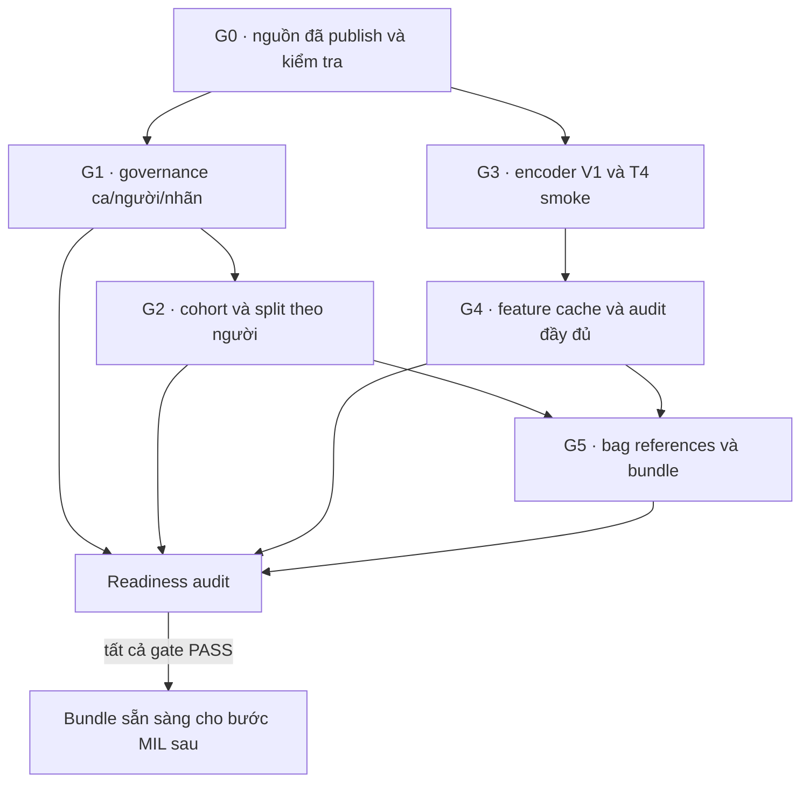

# PRETRAIN_EXECUTION — kế hoạch trước huấn luyện MIL

> Kế hoạch thực thi v1.1, cập nhật ngày 10/10/2026 từ [MIL_MULTISCALE_REFERENCE.md](MIL_MULTISCALE_REFERENCE.md). Phạm vi gồm G0–G5 và kiểm tra sẵn sàng dữ liệu; không bao gồm huấn luyện MIL, đánh giá outer test hoặc báo cáo kết quả. Nhãn và danh tính người bệnh đã được người dùng xác nhận; artifact governance, split, bag và readiness vẫn cần được tạo, kiểm tra.

## Trạng thái và nguyên tắc

- `DONE`: có bằng chứng cho đúng phạm vi ghi nhận; không suy rộng kết quả smoke thành xác nhận toàn bộ dữ liệu.
- `CONFIRMED`: người dùng đã xác nhận sự thật nghiệp vụ; artifact có phiên bản và kiểm toán vẫn còn phải tạo.
- `RUNNING`: đang chạy trên T4 dưới quyền điều khiển của chat người dùng; chỉ nối tiếp sau khi writer hiện tại kết thúc.
- `IN DEVELOPMENT` hoặc `PLANNED`: chưa có artifact được tạo và kiểm tra.
- Mọi công việc nặng chạy trên Colab. Ngân sách là 330 phút mỗi profile/ngày, giữ 30 phút dự phòng. Tính thời gian còn lại theo hạn tuyệt đối của profile trước khi bắt đầu tác vụ mới.
- Drive là lưu trữ bền; `/content` là scratch của phiên. Chỉ một writer được dùng `$DRIVE_ROOT/features/v001/` tại một thời điểm.
- Giữ nguyên PNG đã duyệt. Không recrop, recolor hoặc gán nhãn patch. Trường `Glade` được giữ làm dữ liệu thô nhưng không dùng cho endpoint nhị phân và không suy ra ISUP/Grade Group.

## Gốc dữ liệu và tình trạng hiện tại

`DRIVE_ROOT=/content/drive/MyDrive/histology`.

| Nội dung | Đường dẫn |
|---|---|
| Metadata | `$DRIVE_ROOT/source/Metadata.xlsx` |
| ZIP đã duyệt | `$DRIVE_ROOT/source/archives/Tiles-20261009T164818Z-1-NNN.zip` (`NNN=001…025`) |
| Runtime extractor | `$DRIVE_ROOT/runtime/histology-feature-runtime.zip` |
| Weights ResNet50 ImageNet V1 | `$DRIVE_ROOT/encoders/resnet50_imagenet_v1/` |
| Smoke | `$DRIVE_ROOT/features/smoke_v001/` |
| Feature production | `$DRIVE_ROOT/features/v001/` |
| Scratch Colab | `/content/histology-feature-work/` |
| Governance drafts | `$DRIVE_ROOT/governance/drafts/<draft_id>/` |
| Governance đã kiểm tra | `$DRIVE_ROOT/governance/<governance_id>/` |
| Bundle và readiness | `$DRIVE_ROOT/bundles/<bundle_id>/` |
| Log/cấu hình mỗi run | `$DRIVE_ROOT/runs/<run_id>/` |

Kiểm kê hiện có 1.812 ảnh nguồn khớp metadata, 148.991 PNG: 10.017 ảnh ở 4×, 25.726 ở 10× và 113.248 ở 40×. Canonical release có 18 ca, không có xung đột với mã ca thứ 19. Có 18 pseudonym người bệnh, 10 ca lành và 8 ca ung thư; 16 ca đủ cả ba lens gồm 9 lành và 7 ung thư. Trong cohort 18 ca, một ca thiếu 4× và một ca chỉ có 40×.

Drive đã có đủ 25/25 ZIP. `Tiles-20261009T164818Z-1-021.zip` có kích thước 2.148.335.383 byte và 6.200 PNG; toàn ZIP đã qua CRC, SHA-256 là `1fd92c47ad46f03534da909c0928cb35254eab52f0158697cc833032e5fe96fb`. Truyền mất 576 giây, xác minh CRC/SHA trên Colab mất 29,811 giây. Production writer hiện tại vẫn chạy trên source plan 24 ZIP/142.791 PNG; lượt tiếp theo phải lập plan mới với 25 ZIP. Full feature cache và audit chưa hoàn tất.

Người dùng xác nhận: mỗi ca release là một người khác nhau; ca có `CARCINOM` được gán 1, kể cả ca hỗn hợp; chỉ tăng sản lành tính, có hoặc không có viêm, được gán 0. Bằng chứng tại `Results/planning_20261010/pretrain/user_confirmation.json` và `case_review_confirmed.csv`, gồm 18 pseudonym. Rà soát 12 báo cáo không thấy xung đột với nhãn nhị phân. `Glade` không được dùng cho task này; việc chưa xác định ngữ nghĩa grade không chặn endpoint nhị phân.

## Sơ đồ thực thi

## G0 — Chốt nguồn và manifest

- **Phụ thuộc:** không.
- **Đầu vào:** 25 ZIP dưới `$DRIVE_ROOT/source/archives/` và metadata tại `$DRIVE_ROOT/source/Metadata.xlsx`.
- **Hành động:** giữ ZIP gốc bất biến; đối chiếu tên, kích thước và checksum với manifest nguồn. ZIP021 đã được publish sau khi truyền xong và qua CRC/SHA.
- **Đầu ra/bằng chứng:** inventory dự án tại `Results/planning_20261010/precut_archive_inventory.json`, `precut_source_images.csv`, `transfer_summary.json`; receipt và checksum ZIP021. Không có artifact source-manifest mới nào được coi là đã sinh nếu chưa xuất hiện trên Drive.
- **Điều kiện đạt:** 25/25 tên ZIP, 148.991 PNG members, coverage lens khớp kiểm kê và 1.812 ảnh nguồn khớp metadata. G4 còn phải đọc/kiểm payload PNG theo từng part và audit toàn release.
- **Trạng thái:** `DONE · transfer`; kiểm tra payload và feature release đầy đủ đang chờ G4.

## G1 — Xây governance ca, người bệnh và nhãn

- **Phụ thuộc:** dữ liệu xác nhận đã có; G0 tiếp tục giữ nguyên snapshot nguồn.
- **Đầu vào:** 18 ca canonical, 18 pseudonym người bệnh, danh sách case review đã xác nhận và nhãn thô trong metadata/báo cáo.
- **Hành động:** giữ nguyên nhãn gốc; áp dụng đúng quy tắc nhị phân đã xác nhận. Không tạo patch labels, không đổi nhãn hỗn hợp có `CARCINOM` thành âm tính.
- **Artifact bằng chứng đã có:** `Results/planning_20261010/pretrain/user_confirmation.json` và `case_review_confirmed.csv`.
- **Đầu ra toolkit dự kiến:** bản nháp tại `$DRIVE_ROOT/governance/drafts/<draft_id>/{case_review.csv,draft.json}`; sau strict review, artifact tại `$DRIVE_ROOT/governance/<governance_id>/{governance.json,cases.csv,case_review.csv}`.
- **Điều kiện đạt:** đủ 18 case, 18 patient pseudonym; đúng 10 nhãn 0 và 8 nhãn 1; đối chiếu provenance từng ca; không có xung đột nhãn nhị phân trong 12 báo cáo đã rà soát. Lưu checksum/version của artifact.
- **Trạng thái:** `CONFIRMED · IN DEVELOPMENT` — sự thật nghiệp vụ đã xác nhận; governance toolkit chưa phát hành artifact đã kiểm toán.

## G2 — Khóa cohort và split theo người

- **Phụ thuộc:** G1 strict review qua; G4 feature plan/release giữ cùng feature identity.
- **Đầu vào:** governance artifact, coverage lens, feature index và quy tắc duplicate.
- **Hành động:** tạo cohort chính 16 ca đủ lens và cohort phụ 18 ca có mask lens thiếu. Chia mọi fold theo `patient_id`; không chia theo patch, ảnh, ca-lens hoặc ZIP. Kiểm tra khả năng thực thi protocol 3 outer × 2 inner trước khi khóa.
- **Đầu ra:** split manifest phiên bản hóa trong `$DRIVE_ROOT/bundles/<bundle_id>/splits.json`; bundle tham chiếu governance ID và checksum. Không tạo split giả trong lúc toolkit còn phát triển.
- **Điều kiện đạt:** không có patient overlap giữa tập train/validation/test; đủ lớp trong các phần cần dùng; seed, cohort, endpoint, threshold control, lens policy và duplicate exclusions được ghi trong artifact.
- **Trạng thái:** `IN DEVELOPMENT` — chưa có split artifact đã tạo và kiểm tra. Nếu cohort không đủ người/lớp cho 3×2, protocol phải được sửa trước khi train.

## G3 — Khóa encoder, preprocessing và preflight

- **Phụ thuộc:** G0 có runtime và PNG đã duyệt; không phụ thuộc việc tạo split.
- **Đầu vào:** `$DRIVE_ROOT/runtime/histology-feature-runtime.zip`, weights `IMAGENET1K_V1`, và sáu PNG smoke thật.
- **Hợp đồng:** đọc RGB; dùng transform chính thức V1 — resize cạnh ngắn 256, center-crop 224×224, chuẩn hóa mean/std ImageNet. Encoder frozen/eval, bỏ classifier ImageNet; đầu ra 2.048 chiều `float32`. Crop chỉ áp dụng lên tensor encoder; PNG nguồn không đổi.
- **Đầu ra:** runtime/weight manifest; `$DRIVE_ROOT/features/smoke_v001/` với vectors, index, QC và commit.
- **Điều kiện đạt:** sáu ảnh, hai ảnh mỗi lens; shape `6×2048`, hữu hạn, dtype float32; tọa độ/lens/tile ID khớp index; checksum commit và preprocessing/weight fingerprint đúng.
- **Trạng thái:** `DONE · smoke` — smoke T4 sáu vector thật hoàn tất trong 112,616 giây. Đây không phải full-cache audit hay kết quả MIL.

## G4 — Trích xuất features và audit release

- **Phụ thuộc:** G0 nguồn đủ; G3 smoke qua. Nhãn/split không cần để mã hóa, nhưng bắt buộc để bundle sẵn sàng.
- **Đầu vào/cấu hình:** ZIP gốc trong `$DRIVE_ROOT/source/archives/`; metadata; runtime feature extractor; ResNet50 V1 frozen, fp32; output duy nhất `$DRIVE_ROOT/features/v001/`.
- **Hành động:** writer hiện tại kết thúc với plan 24 ZIP; sau đó resume cùng output/feature identity để inventory 25 ZIP. Không chạy writer song song, không xóa lock và không dùng stale-lock recovery.
- **Đầu ra thực tế:** `$DRIVE_ROOT/features/v001/status.json` và `$DRIVE_ROOT/features/v001/<feature_id>/parts/<part_id>/{features.npy,tile_index.jsonl,qc.json,commit.json}`; source plans, release, audit và run events nằm trong cùng cây feature/output.
- **Điều kiện đạt:** đủ 25 archive và 148.991 PNG; kiểm CRC/PNG decode, metadata, coverage lens, vector finite/shape/dtype, commit checksums, row order, duplicate groups và global release audit. Status cần `complete`, `source_complete=true`, `feature_complete=true`; `training_ready` vẫn false cho đến khi G1/G2/G5 qua.
- **Trạng thái:** `RUNNING` — chat **Chạy trích xuất features trên Colab** sở hữu T4 writer `histology-features-resume-20261010`; plan hiện tại có 24 ZIP/142.791 PNG. ZIP021 đã publish; lần resume sau phải dùng plan 25. Full cache và audit chưa xong.
- **Ngân sách:** 330 phút mỗi profile/ngày, trừ 30 phút dự phòng. Resume có thể xác minh lại các commit/ZIP cũ; tính giới hạn theo hạn tuyệt đối sau khi writer hiện tại kết thúc. Không bắt đầu nếu thời gian còn lại không vượt reserve.

## G5 — Tạo bag references và bundle

- **Phụ thuộc:** G1 strict governance, G2 splits, G4 full release và audit.
- **Đầu vào:** release feature đã commit, `tile_index.jsonl`, governance ID, label/case references và split manifest.
- **Hành động:** nhóm theo `case_id × objective_lens`. Bags chỉ chứa tham chiếu hàng feature; không sao chép ma trận vectors. Tạo bundle ID riêng cho cohort chính 16 ca đủ lens và cohort phụ 18 ca có mask. Giữ mask cho một ca thiếu 4× và một ca chỉ có 40×; không tạo dữ liệu giả.
- **Đầu ra toolkit dự kiến:** mỗi cohort có cây riêng `$DRIVE_ROOT/bundles/<bundle_id>/{bags.jsonl,instance_refs.jsonl,splits.json,bundle.json,training_readiness.json}`.
- **Điều kiện đạt:** bag IDs có namespace/version rõ; mỗi instance truy được `feature_id`, `part_id`, `tile_id`, `row_index`, `image_id`, lens và tọa độ. Kiểm referential integrity, số hàng, mask, split theo người và duplicate groups; cùng nội dung ảnh không được vượt qua hai patient split. Không broadcast nhãn ca thành patch target.
- **Trạng thái:** `IN DEVELOPMENT` — schema/tooling đang được phát triển; chưa có bundle artifact được tạo và audit.

## R — Training-readiness audit trước MIL

Ghi kết quả vào `$DRIVE_ROOT/bundles/<bundle_id>/training_readiness.json`. Mỗi gate có `pass|blocked|fail`, artifact path, checksum và lý do. Không mặc định `READY`.

| Gate | Điều kiện PASS | Snapshot hiện tại |
|---|---|---|
| R0 · nguồn | 25 ZIP và inventory 148.991 PNG; full payload/release audit qua | `RUNNING` — transfer 25/25 xong; full feature audit chưa xong |
| R1 · governance | 18 ca/18 người, 10/8 nhãn, provenance và strict review có checksum | `CONFIRMED · IN DEVELOPMENT` — user evidence có; toolkit artifact chưa phát hành |
| R2 · split | cohort chính/phụ và split không giao người, fold hợp lệ, seed/policy đã khóa | `IN DEVELOPMENT` — split chưa sinh/audit |
| R3 · encoder/cache | V1 transform, weights/code fingerprint; full feature release/audit qua | `RUNNING` — T4 smoke qua; production còn chạy |
| R4 · bundle | references/masks/splits/duplicates và mọi checksum qua | `IN DEVELOPMENT` — chưa tạo/audit bundle |

Chỉ đặt `READY` khi R0–R4 đều `PASS`. User-confirmed truth không thay strict governance artifact và kiểm tra mã. Nhãn gốc `Glade` không chặn binary task vì không tham gia target.

## Ranh giới

Kế hoạch kết thúc tại bundle và readiness audit. Không huấn luyện MIL, đánh giá outer test, tạo báo cáo kết quả hoặc export model trong phạm vi này. Khi mọi gate PASS, bước sau cần một kế hoạch và phê duyệt riêng; tài liệu này không ghi nhận kết quả khoa học hay phê duyệt chưa xảy ra.

## Bằng chứng và cập nhật

- Kiểm kê: `Results/planning_20261010/precut_archive_inventory.json`, `precut_source_images.csv`, `transfer_summary.json`.
- Xác nhận người dùng: `Results/planning_20261010/pretrain/user_confirmation.json`, `case_review_confirmed.csv`.
- Cập nhật status, run ID và số part từ `$DRIVE_ROOT/features/v001/status.json` trước khi thay snapshot tài liệu. Log/commit là bằng chứng thực thi; mô tả kế hoạch không thay thế chúng.
